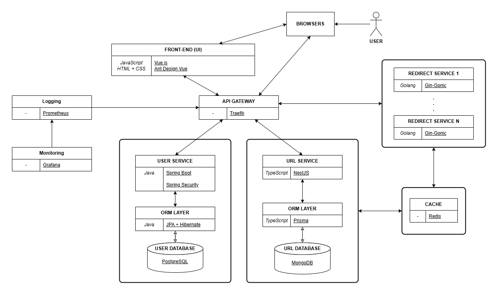
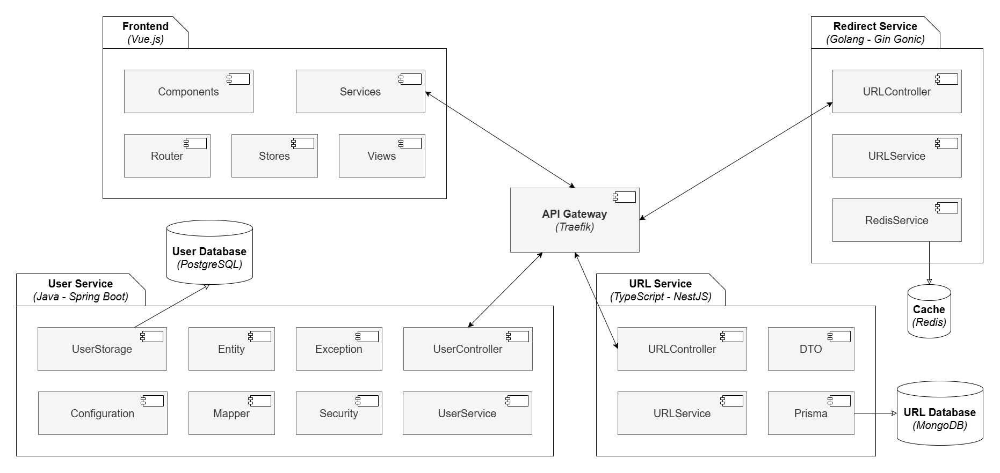
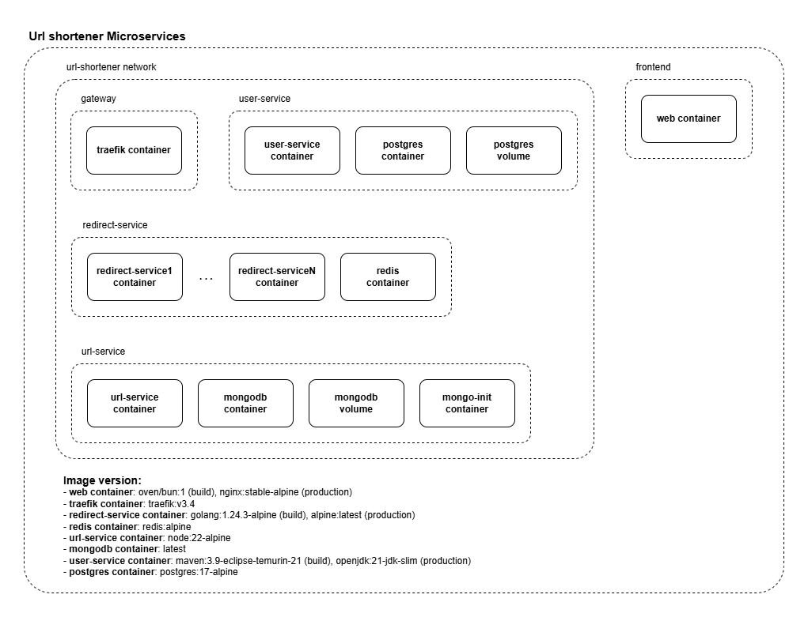
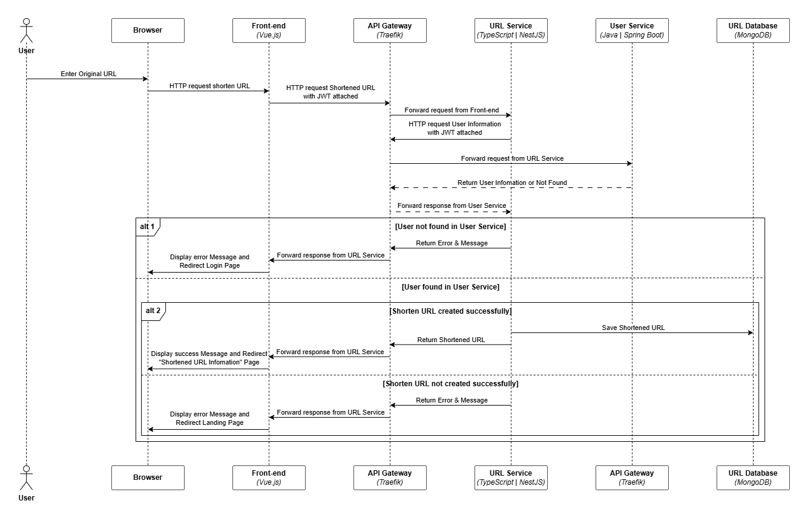
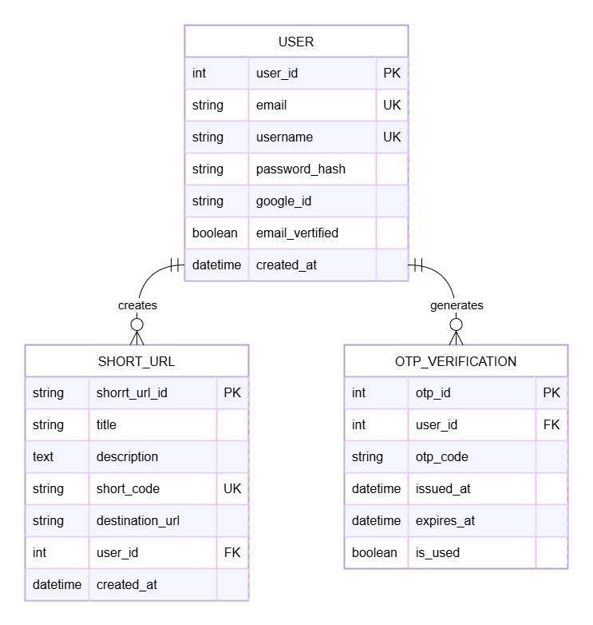

# Kiến trúc Microservices

ĐẠI HỌC QUỐC GIA THÀNH PHỐ HỒ CHÍ MINH 
TRƯỜNG ĐẠI HỌC KHOA HỌC TỰ NHIÊN 
KHOA CÔNG NGHỆ THÔNG TIN

**Môn học:** Kiến trúc phần mềm  
**Giảng viên lý thuyết:** TS. Ngô Huy Biên  
**Giảng viên thực hành:**
- ThS. Ngô Ngọc Đăng Khoa
- ThS. Hồ Tuấn Thanh  

**Nhóm sinh viên:**
- 22127323 - Lê Tấn Phát 
- 22127379 - Võ Duy Tân  
- 22127431 - Lê Nguyễn Hữu Trường 
- 22127437 - Phùng Anh Tuấn 

**Năm học:** 2024 - 2025  
---

## MỤC LỤC
1. [Thông tin thành viên nhóm](#thông-tin-thành-viên-nhóm)  
2. [Cơ sở lý thuyết](#cơ-sở-lý-thuyết)  
   - [Microservices là gì?](#microservices-là-gì)  
   - [Lợi ích của Microservices](#lợi-ích-của-microservices)  
   - [Khi nào nên/không nên dùng Microservices?](#khi-nào-nênkhông-nên-dùng-microservices)  
   - [Thành phần của kiến trúc Microservices](#thành-phần-của-kiến-trúc-microservices)  
   - [Thách thức khi triển khai Microservices](#thách-thức-khi-triển-khai-microservices)  
   - [Lý do chọn Microservices cho hệ thống Shortener URL](#lý-do-chọn-microservices-cho-hệ-thống-shortener-url)  
3. [Nội dung sản phẩm](#nội-dung-sản-phẩm)  
   - [Use Case View](#use-case-view)  
   - [Logical View](#logical-view)  
   - [Development View](#development-view)  
   - [Deployment View](#deployment-view)  
   - [Process View](#process-view)  
   - [Entity Relationship Diagram (ERD)](#entity-relationship-diagram-erd)  
   - [Kiểm chứng thuộc tính chất lượng](#kiểm-chứng-thuộc-tính-chất-lượng)  

---

## 1. Thông tin thành viên nhóm
| STT | Họ và tên                | MSSV     |
|-----|--------------------------|----------|
| 1   | Lê Tấn Phát             | 22127323 |
| 2   | Võ Duy Tân              | 22127379 |
| 3   | Lê Nguyễn Hữu Trường    | 22127431 |
| 4   | Phùng Anh Tuấn          | 22127437 |

---

## 2. Cơ sở lý thuyết

### Microservices là gì?
**Mô tả:** Microservices là kiến trúc phần mềm chia ứng dụng thành các dịch vụ nhỏ, độc lập, mỗi dịch vụ thực hiện một chức năng riêng, giao tiếp qua HTTP (REST, gRPC) hoặc message queue (Kafka, RabbitMQ).  
**Đặc điểm:**  
- Hoạt động độc lập, dùng ngôn ngữ và cơ sở dữ liệu riêng.  
- Dễ bảo trì, nâng cấp, mở rộng. 
 
**Ví dụ:** Trong hệ thống mua sắm, các dịch vụ như xác thực, giỏ hàng, thanh toán,... hoạt động riêng lẻ nhưng phối hợp chặt chẽ.

### Lợi ích của Microservices
- **Bảo trì dễ dàng:** Chỉ sửa Service bị lỗi mà không ảnh hưởng toàn hệ thống.  
- **Mở rộng linh hoạt:** Nhân bản từng Service theo nhu cầu.  
- **Phát triển nhanh:** Các nhóm làm việc song song, chọn công nghệ phù hợp.  
- **Chịu lỗi tốt:** Lỗi ở một dịch vụ không ảnh hưởng toàn hệ thống.  
- **Đổi mới công nghệ:** Thử nghiệm công nghệ mới mà không ảnh hưởng toàn ứng dụng.

### Khi nào nên/không nên dùng Microservices?
**Nên dùng khi:**  
- Hệ thống lớn, phức tạp.  
- Có nhiều nhóm phát triển song song.  
- Cần triển khai liên tục (CI/CD) hoặc chịu tải cao.  

**Không nên dùng khi:**  
- Hệ thống nhỏ, đơn giản (nguy cơ over-engineering).  
- Nhóm phát triển nhỏ, thiếu kinh nghiệm.  
- Ngân sách/thời gian hạn chế.  
- Yêu cầu tính nhất quán dữ liệu nghiêm ngặt.

### Thành phần của kiến trúc Microservices
1. **Cấu trúc mỗi Service:**  
   - **Logic nghiệp vụ:** Xử lý chức năng cụ thể (ví dụ: tạo/xóa URL).
   - **API:** REST hoặc gRPC để giao tiếp.
   - **Cơ sở dữ liệu riêng:** Đảm bảo độc lập (ví dụ: MongoDB cho URL Service).
   - **Cấu hình:** Quản lý thông tin kết nối và tham số logic.
   - **Logging/Monitoring:** Ghi log và theo dõi hiệu suất.
   - **Trong hệ thống Shortener URL:** URL Service (TypeScript, NestJS, Prisma, MongoDB) xử lý rút gọn URL, cung cấp RESTful API.  

2. **Giao tiếp giữa các Service:**  
   - **REST:** Dùng HTTP, JSON/XML, đơn giản, dễ debug, phù hợp cho client đa dạng.  
   - **gRPC:** Hiệu suất cao, dùng HTTP/2 và Protobuf, phù hợp cho giao tiếp nội bộ, độ trễ thấp.  
   - **Trong hệ thống Shortener URL:** REST được chọn vì dễ tích hợp với Vue.js, đơn giản và đủ hiệu suất.  

3. **Message Broker (Kafka, RabbitMQ):**  
   - **Vai trò:** Tách rời dịch vụ, chịu lỗi, xử lý sự kiện không đồng bộ.  
   - **Kafka:** Xử lý dữ liệu lớn, thời gian thực, phù hợp cho data pipeline.  
   - **RabbitMQ:** Định tuyến tin nhắn linh hoạt, phù hợp cho background jobs.  

4. **API Gateway:**
   - **API Gateway (Traefik):** Định tuyến yêu cầu, xác thực, giới hạn tốc độ (rate limiting).
   - **Reverse Proxy:** Ẩn IP backend, cân bằng tải, caching.
   - **Load Balancer:** Phân phối yêu cầu, tăng khả năng mở rộng.

5. **Monitoring & Logging:**
   - **Monitoring:** Theo dõi hiệu suất (Prometheus, Grafana).
   - **Logging:** Ghi sự kiện, lỗi (ELK Stack, Loki).
   - **Trong hệ thống Shortener URL:** Traefik gửi metrics, mỗi service ghi log riêng, cần hệ thống logging tập trung.

6. **Service Discovery:**
   - **Vai trò:** Tự động phát hiện dịch vụ mới hoặc thay đổi.
   - **Cơ chế:** Traefik dùng labels trên container Docker để định tuyến.
   - **Lợi ích:** Hỗ trợ mở rộng động, giảm cấu hình thủ công.

7. **Circuit Breaker:**
   - **Vai trò:** Ngăn lỗi lan rộng khi dịch vụ gặp sự cố.
   - **Cơ chế:** Chuyển sang trạng thái "mở" nếu lỗi lặp lại, trả về phản hồi mặc định.
   - **Trong hệ thống Shortener URL:** Áp dụng cho User Service và URL Service qua Resilience4j.

8. **Containers & Orchestration:** 
   - **Containers (Docker):** Đóng gói dịch vụ, đảm bảo môi trường đồng nhất.
   - **Orchestration (Kubernetes):** Quản lý container, tự động mở rộng, tự phục hồi.
   - **Trong hệ thống Shortener URL:** Dùng Docker cho mỗi dịch vụ, Kubernetes quản lý Redirect Service.

9. **Configuration Server:** 
   - **Vai trò:** Quản lý cấu hình tập trung, hỗ trợ thay đổi động.
   - **Công cụ:** Spring Config Server hoặc Consul (chưa triển khai).
   - **Lợi ích:** Giảm thời gian cấu hình lại dịch vụ.

0. **Distributed Tracing:** 
   - **Vai trò:** Theo dõi yêu cầu qua các dịch vụ để phát hiện lỗi và tối ưu.
   - **Công cụ:** Jaeger hoặc Zipkin, tích hợp với Traefik.
   - **Trong hệ thống Shortener URL:** Hỗ trợ debug khi Redirect Service truy xuất URL Service.
   

### Thách thức khi triển khai Microservices
- **Phức tạp:** Quản lý nhiều service, cơ sở dữ liệu.
- **Dữ liệu phân tán:** Đảm bảo nhất quán khó khăn.
- **Yêu cầu DevOps:** Cần kỹ năng cao.
- **Chi phí:** Vận hành tốn kém hơn monolith.

### Lý do chọn Microservices cho hệ thống Shortener URL
- **Scalability:** Mở rộng từng Service (e.g., URL Service) theo nhu cầu.  
- **Technology Heterogeneity:** Linh hoạt chọn công nghệ (TypeScript, MongoDB).  
- **Independent Deployment:** Triển khai từng Service mà không ảnh hưởng hệ thống.  
- **Resilience:** Một Service sập không làm toàn hệ thống ngừng hoạt động.  
- **Maintainability:** Dễ bảo trì, phát triển độc lập bởi các nhóm.  

---

## 3. Nội dung sản phẩm

### Use Case View

<pre>
<b>Actor:</b> AnonymousUser, Logged in User  

<b>Chức năng:</b>
- <b>Tất cả:</b> Truy cập URL rút gọn.
- <b>AnonymousUser:</b>
   + Đăng ký.
   + Đăng nhập.
- <b>Logged in User:</b> 
   + Tạo/xem/xóa URL rút gọn.
   + Đăng xuất.
</pre>

### Logical View

**Thành phần:**
- **Frontend (Vue.js):** Giao diện người dùng.
- **API Gateway (Traefik):** Định tuyến, xác thực.
- **User Service (Java/Spring):** Đăng ký, đăng nhập, PostgreSQL.
- **URL Service (TypeScript/NestJS):** Tạo/xem/xóa URL, MongoDB.
- **Redirect Service (Golang/Gin):** Chuyển hướng, Redis cache.
- **Monitoring (Prometheus/Grafana):** Theo dõi hiệu suất.

**Giao tiếp:** HTTP (Frontend, API Gateway, Services), TCP (Databases), Redis protocol.

### Development View

**Cấu trúc mã nguồn:**
- **Frontend:** Vue.js (Components, Services, Router, Stores, Views, docker-compose.yml).
- **API Gateway:** Traefik (docker-compose.yml).
- **User Service:** Java/Spring (UserController, UserService, UserStorage, Entity, Security, docker-compose.yml).
- **URL Service:** TypeScript/NestJS (URLController, URLService, Prisma, DTO, docker-compose.yml).
- **Redirect Service:** Golang/Gin (URLController, URLService, RedisService, docker-compose.yml).

**Khởi chạy:**
- **Frontend:** `bun install`, `bun run dev` (localhost:5173).
- **User Service:** Maven, `mvn spring-boot:run`, PostgreSQL.
- **URL Service:** `npm install`, `npm run dev`, MongoDB.
- **Redirect Service:** `go mod tidy`, `go run main.go`, Redis.
- **Redis:** `docker run redis/redis-stack-server`.

### Deployment View

**Cấu trúc container:**
- **Network:** url-shortener.
- **Gateway:** Traefik (v3.4).
- **User Service:** Java (openjdk:21), PostgreSQL (postgres:17), volume.
- **URL Service:** Node.js (node:22), MongoDB (latest), volume, mongo-init.
- **Redirect Service:** Golang (alpine), Redis (alpine), multiple instances.
- **Frontend:** Vue.js (nginx:stable-alpine).

**Triển khai:**
- **Localhost:** Cấu hình .env, `make run`.
- **Docker:** `make all`.
- **Kubernetes:** Cấu hình .yaml, chạy script triển khai, truy cập localhost:3030 (UI) hoặc localhost:8081 (Traefik dashboard). 

### Process View

1. **Tính năng 1: Tạo URL rút gọn**  
   1. Người dùng nhập URL gốc qua Frontend.
   2. Frontend gửi HTTP request (JWT) qua API Gateway đến URL Service.
   3. URL Service kiểm tra người dùng qua User Service.
   4. Nếu hợp lệ, tạo và lưu URL rút gọn vào MongoDB, trả về Frontend.
   5. Frontend hiển thị thành công hoặc lỗi.

2. **Tính năng 2: Truy cập URL rút gọn**  
   1. Người dùng nhập URL rút gọn qua trình duyệt.
   2. API Gateway định tuyến đến Redirect Service.
   3. Redirect Service kiểm tra Redis cache.
   4. Nếu không có, lấy URL gốc từ URL Service, lưu vào cache.
   5. Chuyển hướng đến URL gốc hoặc trả lỗi 404.

### Entity Relationship Diagram (ERD)

<pre>
<b>Thực thể:</b>
   - <b>USER:</b> user_id (PK), email (UK), username (UK), password_hash, google_id, email_verified, created_at.
   - <b>SHORT_URL:</b> short_url_id (PK), short_code (UK), destination_url, user_id (FK), title, description, created_at.
   - <b>OTP_VERIFICATION:</b> otp_id (PK), user_id (FK), otp_code, issued_at, expires_at, is_used.

<b>Quan hệ:</b>
   - USER - SHORT_URL (1:N): user_id.
   - USER - OTP_VERIFICATION (1:N): user_id.
</pre>

### Kiểm chứng thuộc tính chất lượng
1. **QA1: Independent Development**  
   - **API giao tiếp:** REST, không chia sẻ code/database.
   - **Cơ sở dữ liệu riêng:** PostgreSQL (User), MongoDB (URL), Redis (Redirect).
   - **Monorepo:** Thư mục riêng cho mỗi service. 
      

      <pre>
      URL-SHORTENER/
      ├── 📁 docs/               # Chứa tài liệu kỹ thuật, hướng dẫn...
      ├── 📁 front-end/          # Dự án giao diện người dùng
      ├── 📁 api-gateway/        # API Gateway, điểm vào duy nhất của hệ thống
      ├── 📁 redirect-service/   # Microservice xử lý chuyển hướng từ URL ngắn đến URL gốc
      ├── 📁 url-service/        # Microservice quản lý việc tạo, đọc, xóa URL ngắn
      ├── 📁 user-service/       # Microservice quản lý thông tin người dùng và xác thực
      ├── 📄 LICENSE             # Giấy phép sử dụng mã nguồn
      └── 📄 README.MD           # File giới thiệu tổng quan về dự án
      </pre>
      

2. **QA2: Independent Deployment**  
   - Mỗi service có docker-compose.yml riêng.
   - Traefik tự động phát hiện container qua labels.
   - Frontend, User, URL, Redirect triển khai độc lập.
3. **QA3: Scalability**  
   - **Mục tiêu:** 100,000 truy cập đồng thời.
   - **Kiểm tra:** JMeter, tạo short URL, cấu hình 100,000 thread trong 1s, chạy 10s.
   - **Kết quả:** Summary Report xác nhận hiệu suất.